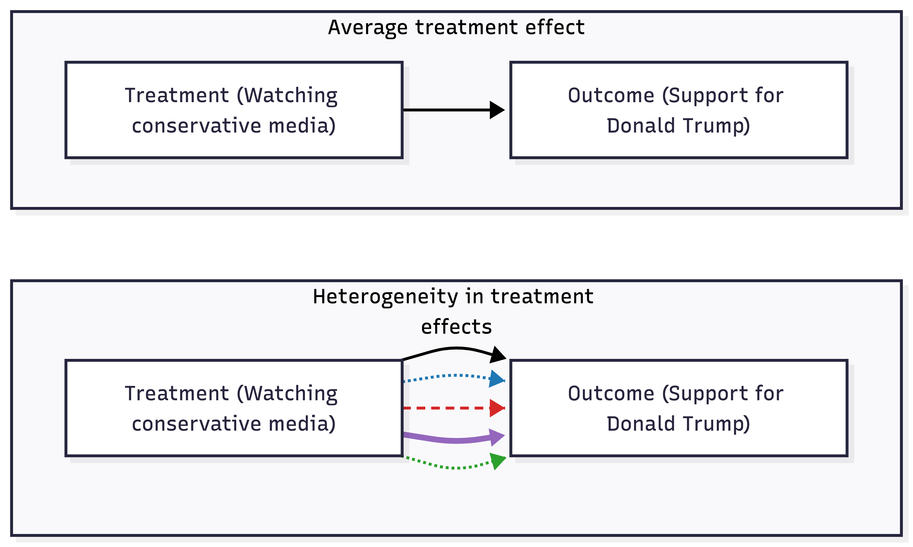
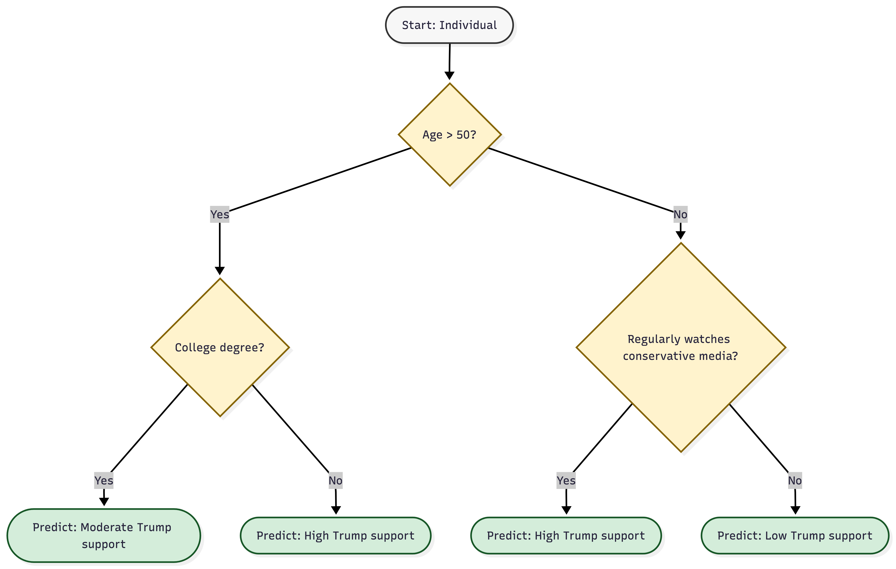
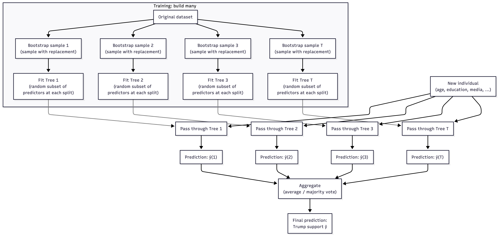

```{r setup, include=FALSE}
# knitr options for document rendering
knitr::opts_chunk$set(
  echo = FALSE, 
  message = FALSE, 
  warning = FALSE,
  fig.width = 7,         # Default figure width
  fig.height = 5         # Default figure height
)

# Set width for code output to prevent lines from running off the page
options(width = 60)
```

```{r load-libraries, message=FALSE, warning=FALSE, echo=FALSE}
# Load required libraries
# Core analysis: grf (causal forests), estimatr (robust regression), texreg (tables)
# Data handling: tidyverse, haven, gssr, gssrdoc, janitor
# Data exploration: skimr, corrr
pacman::p_load(
  tidyverse,   # Data manipulation and visualization
  grf,         # Causal forest implementation
  haven,       # Import GSS data
  estimatr,    # Robust regression models
  texreg,      # Regression table formatting
  skimr,       # Data summaries
  gssr,        # GSS data access
  gssrdoc,     # GSS documentation
  janitor,     # Data cleaning utilities
  corrr        # Correlation analysis
)
```

```{r define-functions}
# ============================================================================
# MEDIAEFFECTS PACKAGE FUNCTIONS
# ============================================================================
# This section defines the core functions for exploring heterogeneous 
# treatment effects using causal forests

# ----------------------------------------------------------------------------
# Function 1: Test for heterogeneity using RATE
# ----------------------------------------------------------------------------
# Tests whether treatment effects vary across individuals using the Rank
# Average Treatment Effect (RATE) method. Returns AUTOC (Area Under the
# Targeting Operator Characteristic) - values > 0 indicate heterogeneity.
#
# Arguments:
#   Y: Outcome variable (numeric vector)
#   W: Treatment variable (binary: 0/1)
#   X: Covariate matrix (data frame or matrix)
#   weights: Optional survey weights (numeric vector)
#   seed: Random seed for reproducibility
#
# Returns: List with RATE object, AUTOC estimate, standard error, and CIs
test_heterogeneity <- function(Y, W, X, weights = NULL, seed = 27011990) {
  set.seed(seed)
  n <- length(Y)
  
  # Split data for training and evaluation
  train_idx <- sample(1:n, n / 2)
  
  # Train forest on training set
  train_forest <- causal_forest(
    X[train_idx, ], 
    Y[train_idx], 
    W[train_idx], 
    sample.weights = if (!is.null(weights)) weights[train_idx] else NULL
  )
  
  # Evaluation forest on evaluation set
  eval_forest <- causal_forest(
    X[-train_idx, ], 
    Y[-train_idx], 
    W[-train_idx], 
    sample.weights = if (!is.null(weights)) weights[-train_idx] else NULL
  )
  
  # Get CATE predictions for evaluation set based on training forest
  cate_estimates_for_eval <- predict(train_forest, X[-train_idx, ])$predictions
  
  # Calculate AUTOC
  rate <- rank_average_treatment_effect(eval_forest, cate_estimates_for_eval)
  
  # Return results
  list(
    rate = rate,
    autoc = rate$estimate,
    std_err = rate$std.err,
    ci_lower = rate$estimate - 1.96 * rate$std.err,
    ci_upper = rate$estimate + 1.96 * rate$std.err,
    train_forest = train_forest,
    eval_forest = eval_forest
  )
}

# ----------------------------------------------------------------------------
# Function 2: Estimate CATEs for all observations
# ----------------------------------------------------------------------------
# Estimates Conditional Average Treatment Effects (CATEs) for each individual
# using a causal forest. Returns individual-level treatment effect estimates
# along with uncertainty measures.
#
# Arguments:
#   Y: Outcome variable (numeric vector)
#   W: Treatment variable (binary: 0/1)
#   X: Covariate matrix (data frame or matrix)
#   ids: Optional ID vector for observations
#   weights: Optional survey weights (numeric vector)
#   num_trees: Number of trees in the causal forest (default: 2000)
#   seed: Random seed for reproducibility
#
# Returns: List with causal forest object, CATE dataframe, ATE, and ATE SE
estimate_cates <- function(Y, W, X, ids = NULL, weights = NULL, 
                          num_trees = 2000, seed = 27011990) {
  set.seed(seed)
  
  # Train causal forest
  cf <- causal_forest(
    X, Y, W,
    num.trees = num_trees,
    honesty = TRUE,
    seed = seed,
    sample.weights = weights,
    tune.parameters = "all"
  )
  
  # Get predictions
  predictions <- predict(cf, estimate.variance = TRUE)
  
  # Calculate ATE
  ate <- average_treatment_effect(cf, target.sample = "all")
  
  # Build results dataframe
  df_cate <- tibble(
    treatment_effect = predictions$predictions,
    standard_error = sqrt(predictions$variance.estimates),
    ci_lower = treatment_effect - 1.96 * standard_error,
    ci_upper = treatment_effect + 1.96 * standard_error,
    quintile = ntile(treatment_effect, 5)
  )
  
  # Add IDs if provided
  if (!is.null(ids)) {
    df_cate <- df_cate %>% mutate(id = ids, .before = 1)
  }
  
  # Return results
  list(
    causal_forest = cf,
    cates = df_cate,
    ate = ate[1],
    ate_se = ate[2]
  )
}

# ----------------------------------------------------------------------------
# Function 3: Identify most important moderators
# ----------------------------------------------------------------------------
# Calculates variable importance scores to identify which covariates drive
# heterogeneity in treatment effects.
#
# Arguments:
#   causal_forest: Fitted causal forest object from estimate_cates()
#   X: Covariate matrix used in fitting the forest
#   top_n: Optional number of top variables to return (NULL = all)
#
# Returns: List with variable importance dataframe and ranked variable names
identify_moderators <- function(causal_forest, X, top_n = NULL) {
  # Calculate variable importance
  varimp <- variable_importance(causal_forest)
  
  # Rank variables
  ranked_vars <- order(varimp, decreasing = TRUE)
  
  # Create results dataframe
  df_varimp <- tibble(
    variable = colnames(X)[ranked_vars],
    importance = varimp[ranked_vars],
    rank = 1:length(varimp)
  )
  
  # Filter to top_n if specified
  if (!is.null(top_n)) {
    df_varimp <- df_varimp %>% slice(1:top_n)
  }
  
  list(
    variable_importance = df_varimp,
    ranked_vars = ranked_vars,
    top_variables = df_varimp$variable
  )
}

# ----------------------------------------------------------------------------
# Function 4: Identify highly correlated variables
# ----------------------------------------------------------------------------
# Finds pairs of variables with correlations above a threshold. Useful for
# pre-analysis checks to avoid collinearity issues.
#
# Arguments:
#   data: Dataframe containing numeric variables
#   threshold: Minimum absolute correlation to report (default: 0.7)
#
# Returns: Tibble with variable pairs and their correlations
highly_correlated <- function(data, threshold = 0.7) {
  data %>%
    select(where(is.numeric)) %>%
    correlate() %>%
    shave() %>%
    stretch(na.rm = TRUE) %>%
    filter(abs(r) >= threshold) %>%
    arrange(desc(abs(r)))
}

# ----------------------------------------------------------------------------
# Function 5: Plot treatment effect histogram by quintile
# ----------------------------------------------------------------------------
# Creates a histogram showing the distribution of individual treatment effects,
# colored by quintile, with ATE shown as a dashed vertical line.
#
# Arguments:
#   df_cate: Dataframe with treatment_effect and quintile columns
#   ate: Average treatment effect value for reference line (optional)
#
# Returns: ggplot object
plot_treatment_effect_histogram <- function(df_cate, ate = NULL) {
  p <- ggplot(df_cate, aes(x = treatment_effect, fill = factor(quintile))) +
    geom_histogram(
      color = "white",
      bins  = 30
    ) +
    scale_fill_brewer(
      palette = "Spectral", 
      name    = "Quintile\n(1 = lowest, 5 = highest)"
    ) +
    theme_bw() +
    theme(legend.position = "bottom") +
    labs(
      x = "Individual Treatment Effect",
      y = "Count",
      title = "Distribution of effects by Quintile"
    )
  
  # Add ATE reference line if provided
  if (!is.null(ate)) {
    p <- p + geom_vline(xintercept = ate, linetype = "dashed")
  }
  
  return(p)
}

# ----------------------------------------------------------------------------
# Function 6: Plot treatment effect violin plot by quintile
# ----------------------------------------------------------------------------
# Creates violin plots showing the distribution of treatment effects within
# each quintile, with ATE shown as a horizontal dashed line.
#
# Arguments:
#   df_cate: Dataframe with treatment_effect and quintile columns
#   ate: Average treatment effect value for reference line
#
# Returns: ggplot object
plot_treatment_effect_violin <- function(df_cate, ate = NULL) {
  p <- ggplot(df_cate, aes(x = factor(quintile), y = treatment_effect, fill = factor(quintile))) +
    geom_violin() +
    theme_bw() +
    scale_fill_brewer(
      palette = "Spectral", 
      name    = "Quintile\n(1 = lowest, 5 = highest)"
    ) +
    coord_flip() +
    labs(x = "Quintile", y = "Effect size",
         title = "Distribution of Treatment Effects by Quintile")
  
  # Add ATE reference line if provided
  if (!is.null(ate)) {
    p <- p + geom_hline(yintercept = ate, linetype = "dashed")
  }
  
  return(p)
}

# ----------------------------------------------------------------------------
# Function 7: Plot moderator heatmap across quintiles
# ----------------------------------------------------------------------------
# Creates a heatmap showing standardized mean values of top moderators across
# treatment effect quintiles. Helps visualize which characteristics are
# associated with larger or smaller treatment effects.
#
# Arguments:
#   df_cate: Dataframe with quintile column and moderator variables
#   top_variables: Character vector of variable names to include
#
# Returns: ggplot object
plot_moderator_heatmap <- function(df_cate, top_variables) {
  df_cate %>%
    group_by(quintile) %>%
    summarise_at(
      vars(all_of(top_variables)),
      ~ mean(., na.rm = T),
    ) %>%
    mutate_at(vars(-quintile), ~ scale(.) %>% as.vector) %>%
    pivot_longer(-quintile, names_to = "variable", values_to = "value") %>%
    mutate(
      variable = factor(variable, levels = rev(top_variables)),
      quintile_label = factor(quintile, 
                              levels = 1:5, 
                              labels = c("1\n(Lowest)", "2", "3", "4", "5\n(Highest)"))
    ) %>%
    ggplot(aes(x = quintile_label, y = variable, fill = value)) +
    geom_tile(color = "white", linewidth = 0.5) +
    geom_text(aes(label = round(value, 2)), size = 3, color = "black") +
    scale_fill_gradient2(low = "#d73027", mid = "#ffffbf", high = "#1a9850", 
                         midpoint = 0, name = "Standardized\nmean") +
    labs(
      x = "Effect size quintile", 
      y = NULL,
      title = "Heterogeneity in conservatives support for Donald Trump"
    ) +
    theme_minimal(base_size = 12) +
    theme(
      legend.position = "right",
      panel.grid = element_blank(),
      axis.text.y = element_text(size = 10)
    )
}
```


# Introduction

When researchers studying communication investigate media effects, they are typically concerned with questions of the form: "What is the effect of exposure to media stimulus X on outcome Y?" For instance, one may ask whether exposure to conservative news content increased support for presidential candidate Donald Trump in 2024, whether social media use influences levels of personal well-being, or whether engagement with online misinformation affects attitudes toward public health campaigns. From an empirical perspective, such questions are addressed by estimating an **average treatment effect** (ATE) - a single scalar quantity summarizing the average causal impact of media exposure across all individuals in a study population. An ATE estimate might indicate, for example, that exposure to conservative news increases support for Donald Trump by 30 points on a 0-100 scale, implying that individuals who watch conservative news tend to rate Donald Trump 30 points higher than those who do not, on average. This approach is represented in the top panel of Figure 1.



The term "treatment", originating in the causal inference literature but widely adopted in communication research, refers to any condition, exposure, or intervention whose effect a researcher wishes to estimate. This treatment could be what the researcher actively manipulates (say, randomly assigning participants to watch conservative news versus moderate content in an experiment), or a naturally occurring exposure or characteristic that distinguishes groups in observational studies and surveys (say, self-reports on whether someone regularly watches conservative news or holds conservative political views). The "outcome" is the variable hypothesized to be affected by the treatment (say, support for Donald Trump). In essence, the treatment is the presumed cause, and the outcome is the presumed effect.

However, our traditional focus on average effects presents a fundamental limitation: the average may conceal substantively important variation across individuals, as illustrated in the bottom panel of Figure 1. Communication research over the past two decades has increasingly recognized that media effects are not uniform; rather, they can vary significantly based on individual characteristics (say, age, gender, political ideology) and contextual factors (say, media type, content characteristics). In empirical terms, we refer to this variation as **heterogeneity** in treatment effects - systematic differences in how individuals respond to the same treatment. The multiple arrows in the bottom panel of Figure 1 represent this concept: different individuals (represented by different arrows) can experience different effect sizes from the same media exposure. Notably, heterogeneity is mathematically equivalent to what empirical work in media psychology refers to as _moderation_: if a treatment effect varies across levels of a third variable (a moderator), then heterogeneity exists by definition. Thus, heterogeneity analysis and moderation analysis are two perspectives on the same underlying phenomenon: capturing variation in effects, as well as identifying the covariates explaining this variance. In our hypothetical example, older conservatives might exhibit a substantial increase in support for Trump following exposure to conservative news content (say, a 50-point change), whereas younger conservatives might display only a modest shift (say, a 10-point change). In this case, an individual's age moderates the effect of conservative news exposure, indicating that heterogeneity exists in the treatment effect. But if only the average treatment effect (30 points) is reported, this meaningful variation between subgroups remains obscured, and a potentially crucial insight about differential media influence is lost.

Our paper addresses these limitations by focusing on the phenomenon of heterogeneity in media effects. We introduce the `mediaeffects` R package, which implements contemporary machine learning methods, specifically the causal forest approach introduced in @wager2018estimation, to facilitate the identification and characterization of heterogeneous treatment effects. Unlike traditional analysis which requires researchers to pre-specify moderation hypotheses, causal forests can discover which variables drive heterogeneity directly from the data without prior specification. The package provides three core analytical capabilities: (1) a formal statistical test for whether heterogeneity exists at all, allowing researchers to determine whether effect variation is meaningful before exploring its sources; (2) individual level treatment effect estimates, providing a predicted effect size for every observation rather than just group averages; and (3) identification of the covariates that drive this heterogeneity, ranked by their importance in explaining variation in effects. 

The **honesty** property of the causal forest algorithm - an insight from the machine learning literature on never training and testing on the same data - is crucial here, as it ensures that the estimated heterogeneous effects are unbiased and valid for statistical inference (that is, have valid confidence intervals). This adaptive approach allows researchers to explore a wide range of potential moderators simultaneously, uncovering complex interactions and nonlinear relationships that traditional methods may miss. Perhaps even more importantly, this approach can uncover "unexpected moderators" that theory alone might not have anticipated, which is particularly valuable in the rapidly evolving media landscape where new forms of media and communication technologies continuously emerge at scale. 

As an illustrative application, we analyze data from the publicly available latest iteration of the US General Social Survey (GSS 2024) to address a substantive question: How does ideological conservatism influence support for 2024 presidential candidate Donald Trump, and among which segments of the conservative population is this effect most pronounced or most attenuated? We also validate results from the causal forest against traditional moderation analysis via linear regression with interaction terms, hence forming a mutually reinforcing triangulation of empirical findings. This validation is crucial to demonstrate that the modern machine learning approach not only uncovers heterogeneity but also aligns with established statistical methods, thereby enhancing the credibility and interpretability of the results. We argue for the causal forest approach to be adopted as a complement to traditional approaches, rather than a replacement, and advocate for its use alongside established techniques to provide a more comprehensive understanding of both the complexity and the diversity in media effects.

# Current approach to exploring heterogeneity

Researchers have traditionally employed two primary methodological approaches to examine whether and how media effects vary across individuals.

## Subgroup analyses

The first strategy is conceptually straightforward, where we partition the sample into subgroups and estimate the model separately within each subgroup. Consider a survey of 1,000 respondents measuring conservative news consumption and evaluations of Donald Trump. Suppose the objective is to assess whether the effect of conservative media exposure on Trump evaluations varies by age. The procedure to assess heterogeneity through subgroup analyses involves three steps:

1. **Partition the sample**: Divide the 1,000 respondents into two age-based subgroups, for example, individuals younger than 40 years (younger adults) and those 40 years and older (older adults).

2. **Estimate models within each subgroup**: For each age group, estimate a linear regression of Trump evaluations on conservative news exposure.

3. **Compare estimated effects across subgroups**: If, for instance, younger adults exhibit an estimated 15-point increase in Trump support associated with conservative news exposure, whereas older adults exhibit a 45-point increase, this pattern hints at treatment effect heterogeneity by age.

Formally, the baseline model for each individual can be expressed as:

\[
Y_i = \beta_0 + \beta_1 \cdot Treatment_i + \epsilon_i,
\]

where \(Y_i\) denotes the Trump evaluation for individual \(i\), and \(Treatment_i\) is an indicator (or measure) of exposure to conservative news. The coefficient \(\beta_1\) captures the causal (or associative) effect of treatment under the usual identification assumptions. 

To examine subgroup heterogeneity, we estimate this model separately for each subgroup \(g\):

\[
Y_{i,g} = \beta_{0,g} + \beta_{1,g} \cdot Treatment_{i,g} + \epsilon_{i,g}.
\]

By comparing the subgroup-specific coefficients \(\beta_{1,g}\) (for example, \(\beta_{1,\text{younger}}\) versus \(\beta_{1,\text{older}}\)), we can assess whether and to what extent the treatment effect varies across groups.

## Linear Regression with Interaction Terms

The second analytical strategy is more statistically efficient as rather than partitioning the sample into subgroups, one can incorporate an **interaction term** within a single regression specification. An interaction term enables the researcher to assess whether the effect of a predictor \(X\) on an outcome \(Y\) is contingent on the value of a third variable \(Z\). In the context of the present example, this corresponds to asking: *Does the effect of exposure to conservative news on support for Donald Trump vary as a function of age?*

The corresponding linear regression model can be written as:

\[
Y_i = \beta_0 + \beta_1 W_i + \beta_2 X_i + \beta_3 (W_i \times X_i) + \epsilon_i,
\]

where:

- \(W_i\) denotes the treatment indicator (exposure to conservative news),
- \(X_i\) denotes the putative moderating variable (age),
- \(W_i \times X_i\) denotes the interaction term (the product of treatment and age),
- \(\beta_3\) quantifies the degree of treatment effect heterogeneity with respect to age.

A positive and statistically significant estimate of \(\beta_3\) implies that the marginal effect of conservative news exposure on Trump support increases with age. Conversely, a negative estimate of \(\beta_3\) indicates that this effect diminishes as age increases.

## Limitations of traditional approaches

Although these methods have been widely used in empirical research for several decades, they exhibit several major limitations. First, moderators must be specified a priori. Prior to the analysis, the researcher must determine which exact variables may plausibly moderate the treatment effect (e.g., age, education, gender). While this requirement rightly presupposes strong theoretical guidance, it also entails a substantial risk of omitting influential moderators that were not initially hypothesized or measured. 

Second, testing multiple moderators inflates the false-positive rate. When examining numerous potential moderators using conventional significance thresholds (e.g., $\alpha = .05$), the familywise probability of obtaining at least one spurious “statistically significant” effect increases sharply. For instance, testing 10 independent moderators at $\alpha = .05$ yields roughly a 40\% probability of at least one false-positive finding. Researchers therefore confront a difficult tradeoff between parsimony (testing few moderators and potentially overlooking true effect heterogeneity) and breadth (testing many moderators and increasing the likelihood of Type I errors).

Third, interaction models typically impose linearity assumptions. Standard interaction terms (e.g., $W \times Age$) presume that the conditional treatment effect varies smoothly and linearly as a function of the moderator. However, treatment effect heterogeneity may be highly nonlinear or threshold dependent - for example, the effect of exposure to conservative news media may be pronounced only among individuals older than 65, with minimal variation among younger cohorts. Simple linear interaction specifications are generally incapable of capturing such complex functional forms.

Fourth, these approaches estimate subgroup averages rather than individual-level effects. Conventional moderation analyses characterize average treatment effects within relatively coarse subgroups (e.g., “older adults” or “college-educated women”). They do not provide individualized effect estimates, and thus cannot directly inform the expected treatment effect for a specific individual with a particular covariate profile.

Fifth, there is no formal omnibus test for heterogeneity. Traditional moderation frameworks focus on hypothesis tests for pre-specified moderators, assessing whether each is associated with variation in treatment effects. They do not, however, furnish a direct, global test of whether any systematic treatment effect heterogeneity is present in the population, irrespective of which specific covariates might be responsible.


# Modern machine learning approaches

Recent advances in machine learning provide novel methodological approaches to addressing these challenges. We will be looking in particular at **causal forests - a class of estimators introduced in econometric literature that constitute a powerful framework for identifying and estimating heterogeneous treatment effects. Prior to understanding causal forests, it is necessary for us to review their fundamental components: decision trees and random forests.

## Decision trees: The basic building block

A **decision tree** is among the most conceptually intuitive algorithms in machine learning. It can be formally characterized as a hierarchical, tree-structured model that recursively partitions any input data by applying a sequence of binary (yes/no) decision rules, analogous to the branching logic of a flowchart, or the interrogative structure of the "20 Questions" game. Through this sequence of dichotomous splits, the model assigns values to distinct terminal nodes, which correspond to predicted outcomes. 

To illustrate this concept concretely using the example of support for Donald Trump, consider the task of predicting an individual's level of support. A decision tree model might proceed as follows:

1. **Initial split**: The first decision rule could be based on age, formulated as: "Is the individual older than 50 years?"
   - If *yes*, follow the left branch.
   - If *no*, follow the right branch.

2. **Subsequent split (for individuals over 50)**: For those in the older age group, a second decision rule might concern educational attainment, such as: "Has this individual completed a college degree?"
   - If *yes*, proceed along the left branch.
   - If *no*, proceed along the right branch.

3. **Recursive partitioning** continues with additional questions (i.e., decision rules) applied at each node, until an endpoint (a **leaf node**) is reached. At each leaf node, the model produces a prediction regarding the individual's level of support for Trump.



The decision tree, visualized in Figure 2, is constructed iterative by the algorithm using the input data. At each iteration, the algorithm performs an exhaustive search over all candidate splitting rules (i.e., all predictor variables and all admissible split points) and selects the rule that maximizes separation of the observations into subsets exhibiting distinct levels of Trump ratings. Mathematically, a partition based on age can be represented as: If $age < 50$, then assign the observation to the left child node, otherwise assign it to the right child node. The algorithm continues recursively partitioning the data until a predefined stopping criterion is satisfied - for instance, when a terminal node (leaf) contains fewer than 10 observations, or when further splits fail to yield a substantively meaningful improvement in predictive performance.

The central implication for our purposes is that decision trees inherently identify _which covariates are most informative and how they interact_. If age and educational attainment jointly influence support for Trump, the decision tree will recover this interaction structure endogenously, without requiring the researcher to pre-specify this as an interaction term.

## Random forests: Wisdom of crowds

A single decision tree exhibits one limitation that it is rather unstable. Minor changes in the data used to build (or 'train' it in machine learning terms) the decision tree can yield markedly different tree structures, which in turn leads to high variance and unreliable predictive performance. A widely used remedy is to construct _an ensemble of decision trees and aggregate their predictions_, typically by averaging predictions for continuous outcomes, or by majority voting for categorical outcomes. This ensemble learning approach is known as a **random forest**. Its fundamental operating principle can be summarized as follows:

1. **Generation of multiple training samples**: Starting from the original dataset, we generate a large number of “bootstrap samples.” Each bootstrap sample has the same predictors as in the original dataset and is constructed via sampling with replacement, implying that some observations may be duplicated within a sample while others may be omitted.

2. **Construction of decision trees on each sample**: For every bootstrap sample, we fit a separate decision tree. Both this time, at each node split, we restrict the splitting criterion to a randomly selected subset of the available predictor variables. This procedure induces diversity among the trees by encouraging them to capture distinct structural relationships within the data.

3. **Aggregation of predictions**: To obtain a prediction of support for Trump for a new individual, we pass this individual's covariate values through each tree in the ensemble, and then compute an average of all individual tree predictions. This aggregated estimate serves as the final model prediction.

Mathematically, the ensemble prediction for observation \(i\) is given by
\[
\hat{y}_i = \frac{1}{T} \sum_{t=1}^{T} \hat{y}_{i}^{(t)},
\]
where \(\hat{y}_i\) denotes the aggregated (final) prediction, \(T\) represents the total number of trees in the ensemble (typically between 500 and 2{,}000), and \(\hat{y}_{i}^{(t)}\) corresponds to the prediction produced by the \(t\)-th tree for observation \(i\). A visual representation of a random forest is provided in Figure 3.



Averaging improves predictive performance substantially because the errors produced by individual trees are largely idiosyncratic and uncorrelated. While any single tree may exhibit substantial variance and commit random errors, aggregating the predictions of many such trees tends to cause these random deviations to cancel each other out. The underlying systematic component of the signal, which is shared across trees, is preserved in the aggregate prediction. This phenomenon is analogous to the statistical principle often referred to as the “wisdom of crowds,” in which the mean of multiple independent estimates typically provides a more accurate approximation of the true quantity than most individual estimates.


## Causal forests: Estimating individual treatment effects

We now arrive at the central methodological innovation towards analyzing heterogeneous treatment effects. In simple terms, causal forests extend the random forest framework to estimate treatment effects rather than solely predicting outcomes. The objective of a causal forest is not to forecast “What is this individual’s rating of Trump?” but instead to estimate “By how much would this individual's rating of Trump change if their political ideology were conservative rather than non-conservative?” This individual-level estimand is referred to as the **Conditional Average Treatment Effect** (or CATE), named so as it is the expected treatment effect conditional on an individual's own covariates.

Causal forests differ from regular random forests. In a standard random forest model used to predict support for Trump, each decision tree recursively partitions the feature space to form subsets of individuals who exhibit similar levels of Trump support. In contrast, in a causal forest, each tree recursively partitions the data to form subsets of individuals who exhibit similar estimated treatment effects. Consider a partition of the sample based on age. A standard (prediction-oriented) random forest addresses the question: “Does age improve my ability to predict Trump approval ratings?” In contrast, a causal forest addresses the question: “Does age help me identify subpopulations in which the effect of conservatism on Trump approval differs?” Thus, even if older and younger individuals exhibit similar average Trump approval levels, the causal forest may detect that conservatism increases Trump support more strongly among older individuals than among younger ones. This differential response represents the treatment effect heterogeneity that the causal forest is designed to uncover.

### The honesty principle

A central methodological challenge arises when machine learning algorithms are applied to empirical data to uncover patterns: there is a substantial risk of what computer scientists call **overfitting** - a situation where the algorithm captures idiosyncratic noise rather than underlying systematic relationships. An overfitted model may appear to perform well on the already seen training data but fails to generalize to new, unseen data. An example of overfitting would be if a model learned that individuals who attended political rallies expressed higher support for Trump, but this pattern was merely a random artifact of the specific sample rather than a true underlying relationship. This issue is particularly problematic in the context of estimating treatment effects, where the objective is to support credible statistical inference, rather than mere prediction.

Causal forests address this very concern through a design principle referred to as **honesty** [@wager2018estimation]. In essence, honesty entails a disciplined separation between the data used to determine the structure of the model (e.g., how to partition the input predictors), and the data used to estimate treatment effects within these resulting partitions. This separation prevents overfitting and enhances the validity of causal effect estimates. The algorithm proceeds as follows for each individual tree in the causal forest:

1. **Partition the dataset into two subsamples**: We randomly divide the input dataset into two mutually exclusive subsets: a *splitting sample* and an *estimation sample*.

2. **Construct the tree structure using the splitting sample**: Employ the splitting sample to determine the optimal partitioning of predictors, that is, to select the variables on which to split and the corresponding split points, thereby defining the tree structure.

3. **Estimate treatment effects using the estimation sample**: Conditional on the tree structure obtained in the previous step, we now use the estimation sample to compute the treatment effect within each terminal node (the 'leaf' nodes) of the tree.

The central idea here is that the same data must never be used both to discover a pattern and then to estimate its effect. A dishonest approach would be guilty of data mining and involve inspecting the data, informally observing that individuals who attended rallies appear to express higher support for Trump, and then formally testing whether rally attendance predicts Trump support in the same dataset (which will almost certainly yield a significant result, because the pattern was selected precisely for that reason). In contrast, the honest approach uses one subset of the data to explore and identify a potentially relevant predictor - such as rally attendance - and then uses a separate, independent subset of the data to test the resulting hypothesis. This honesty principle underlies causal forests and guarantees that the resulting estimates are statistically valid, including the construction of appropriate confidence intervals and the implementation of valid hypothesis tests.

The overall estimation algorithm for a causal forest can be summarized as follows:

1. **Generate multiple bootstrap samples** from the original dataset, analogous to the resampling step in standard random forests.

2. **For each bootstrap sample, partition the data into a splitting subsample and an estimation subsample** (this constitutes the *honesty* condition).

3. **Construct a tree using the splitting subsample**: At each internal node, select the covariate and split point that maximize heterogeneity in treatment effects across the resulting child nodes.

4. **Estimate treatment effects using the estimation subsample**: For each terminal node (leaf), compute the average treatment effect among the observations assigned to that leaf.

5. **Predict the conditional average treatment effect for a new unit**: Pass the feature vector of the new observation through each tree, identify the corresponding leaf in every tree, extract the estimated treatment effect from that leaf, and then average these estimates over all trees.

Formally, the CATE for individual \(i\) is given by

\[
\hat{\tau}(X_i) = \frac{1}{T} \sum_{t=1}^{T} \hat{\tau}^{(t)}(X_i),
\]

where \(\hat{\tau}(X_i)\) denotes the estimated treatment effect for individual \(i\), \(T\) is the total number of trees in the forest, and \(\hat{\tau}^{(t)}(X_i)\) is the treatment effect estimate produced by tree \(t\) for the leaf into which individual \(i\) is classified.

Causal forests offer several crucialadvantages over traditional estimation methods. First, there is no requirement to pre-specify effect moderators. The algorithm endogenously identifies covariates that systematically drive treatment effect heterogeneity, without the need for a priori selection of exact interaction terms. Second, causal forests excel at capturing nonlinear and high-order interactions. Causal forests flexibly model complex, potentially non-monotonic functional relationships between treatment effects and covariates (e.g., age, educational attainment), without imposing restrictive parametric forms.
Thirs, we can now estimate individual-level treatment effects conditional on their own covariates. The method yields conditional average treatment effect (CATE) estimates at the unit level, providing a predicted treatment effect for each individual rather than only for predefined subgroups or population averages. Fourth, we also gain a formal hypothesis test for assessing presence of heterogeneity. Prior to estimating individual-level CATEs, causal forests enable rigorous statistical tests to assess whether any systematic treatment effect heterogeneity is present. And most importantly, we have statistically valid inference procedures. Owing to the “honesty” property in tree construction - where separate subsamples are used for partitioning and estimation - causal forests support  valid confidence intervals and hypothesis tests for treatment effects. Moreover, the causal forest approach is applicable in both experimental and observational settings, provided that standard identification assumptions of statistical inference are satisfied.

# Illustrative example using `mediaeffects` R package

In this section, we provide an applied illustration of these methods using the `mediaeffects` package in R. The empirical analysis relies on data from the 2024 General Social Survey (GSS), for which a searchable codebook is available [here](https://gssdataexplorer.norc.org/variables/vfilter). The focal research question we explore here is: *Does the impact of ideological conservatism on support for Donald Trump exhibit systematic heterogeneity across individuals, and, if so, which individual-level characteristics account for this variation?*

```{r load-data, include=FALSE}
# ============================================================================
# DATA LOADING AND PREPROCESSING
# ============================================================================

# Load GSS 2024 data and perform initial cleaning
df <-
  gss_get_yr(2024) %>%
  remove_empty() %>% 
  remove_constant()

# Select variables with at least 75% complete cases
selected_vars <- 
  df %>% 
  mutate(across(everything(), as.numeric)) %>%
  mutate(across(everything(), ~if_else(. < 0, NA_real_, .))) %>%
  skim() %>% 
  as_tibble() %>% 
  filter(complete_rate >= 0.75) %>% 
  select(skim_variable) %>% 
  arrange(skim_variable) %>% 
  pull()

# Add these in as needed, have more missingness so not added by default
comm_vars_additional <- c(
  # media use & exposure
  "news", "tvhours", "xmovie", "xmoviey", "webmob", "broadband", "mobiledata",
  
  # internet use (issp digital societies)
  "intrnetuse", "inthome", "intprfssnl", "intpub", "intcomm", "intnews", 
  "intsearch", "intshare", "intstream", "intgame", "intfncl",
  
  # digital literacy & skills
  "intskill", "intsurf", "intapps", "intliteracy", "intcnfrm",
  
  # online political communication
  "inttrig", "intviews", "intoppo", "intpolview", "polnews", "polnewsfrom",
  
  # trust & social effects online
  "intrust", "intmeet", "intlnly", "inthrss", "intscam",
  
  # digital proxy use
  "intbhlf", "intaccprxy", "prxyuse", "ftruse",
  
  # non-use reasons
  "nouseint1", "nouseint2", "nouseint3", "nouseint4", "nouseint5", "nouseint6",
  "nouseint7", "nouseint8", "nouseint9", "nouseint10", "nouseint11", "nouseint12",
  
  # digital detox
  "unplug", "unplgrsn",
  
  # news source reliability
  "tvnews1", "webnews", "radionews", "papernews", "smnews", "biasnews",
  
  # confidence in media
  "conpress", "contv",
  
  # technology attitudes
  "harmgood1", "techesy", "aiworry", "aidrive", "aimed", "nextgen1",
  
  # data privacy & surveillance
  "dataprot", "emonitor1", "infodeal", "infoprofit", "cctv",
  
  # digital divide
  "agetech", "classtech", "eductech", "gendtech", "urbantech",
  
  # free speech & censorship
  "spkath", "spkathy", "colath", "libath", "libathy", "spkrac", "spkracy", 
  "colrac", "librac", "libracy", "spkcom", "spkcomy", "colcom", "colcomy", 
  "libcom", "libcomy", "spkmslm", "spkmslmy", "colmslm", "libmslm", "libmslmy", 
  "pornlaw",
  
  # general trust
  "trust", "trustv", "trustnv", "trppl", "helpful", "helpfulv", "helpfulnv",
  "fair", "fairv", "fairnv", "befair",
  
  # confidence in institutions
  "consci", "coneduc", "confed", "conlegis", "conjudge",
  
  # political communication
  "polint", "polviews", "partyid", "pres16", "pres20", "poleff11", "poleff18", 
  "leftrght", "leftrght1",
  
  # political participation
  "modelobby", "modepet", "modeprot", "modeorg", "modeorgprot", "watchgov",
  
  # social contact
  "socrel", "socfrend", "socommun", "socbar",
  
  # cultural/media
  "amtv", "smedia", "violtv"
)

# Keep only selected variables
df <- df %>% select(all_of(selected_vars))

# ----------------------------------------------------------------------------
# Data cleaning pipeline for causal forest analysis
# ----------------------------------------------------------------------------
# Steps:
# 1. Convert all variables to numeric
# 2. Replace GSS missing codes with NA
# 3. Recode variables for intuitive interpretation (higher = more/better)
# 4. Impute missing values (median for continuous, mode for categorical)
# 5. Create derived variables

# Helper function: Mode imputation for categorical variables
get_mode <- function(x) {
  x <- x[!is.na(x)]
  if (length(x) == 0) return(NA_real_)
  ux <- unique(x)
  ux[which.max(tabulate(match(x, ux)))]
}

df_clean <- 
  df %>%
  
  # Step 1: Convert all haven-labelled columns to plain numeric
  mutate(across(everything(), as.numeric)) %>%
  
  # Step 2: Replace ALL GSS missing value codes with NA
  # GSS codes: -100 (IAP), -99 (NA), -98 (DK), -97 (skipped), -96, -95, -94, -93, -90, -80, -70, -60
  mutate(across(everything(), ~if_else(. < 0, NA_real_, .))) %>%
  
  # Step 3: Recode specific variables for intuitive direction (higher = "more"/"better")
  mutate(
    # Wellbeing/satisfaction: reverse so higher = better
    happy = 4 - happy,
    health = 5 - health,
    satfin = 4 - satfin,
    satdemoc = 5 - satdemoc,
    econstat = 6 - econstat,
    
    # Financial trajectory: recode so 3=better, 2=same, 1=worse
    finalter = case_when(
      finalter == 1 ~ 3,
      finalter == 2 ~ 1,
      finalter == 3 ~ 2,
      TRUE ~ NA_real_
    ),
    
    # Interest/engagement: reverse so higher = more
    polintrst = 4 - polintrst,
    relpersn = 5 - relpersn,
    sprtprsn = 5 - sprtprsn,
    svyenjoy = 6 - svyenjoy,
    svyid1 = 5 - svyid1,
    svyid2 = 5 - svyid2,
    lkelyvot = 6 - lkelyvot,
    fund = 4 - fund,
    fund16 = 4 - fund16,
    pray = 6 - pray,
    xnorcsiz = 11 - xnorcsiz,
    
    # Perceived discrimination: reverse so higher = more perceived
    discaff = 4 - discaff,
    
    # Binary yes/no: recode to 1=Yes, 0=No
    born = if_else(born == 1, 1, 0),
    maborn = if_else(maborn == 1, 1, 0),
    paborn = if_else(paborn == 1, 1, 0),
    compuse = if_else(compuse == 1, 1, 0),
    othlang = if_else(othlang == 1, 1, 0),
    reborn = if_else(reborn == 1, 1, 0),
    raclive = if_else(raclive == 1, 1, 0) %>% replace_na(0),
    pawrkgrw = if_else(pawrkgrw == 1, 1, 0),
    mawrkgrw = if_else(mawrkgrw == 1, 1, 0),
    wrkslf = if_else(wrkslf == 1, 1, 0),
    wrkgovt1 = if_else(wrkgovt1 == 1, 1, 0),
    wrkgovt2 = if_else(wrkgovt2 == 1, 1, 0),
    diagnosd = if_else(diagnosd == 1, 1, 0),
    dipged = if_else(dipged == 1, 1, 0),
    
    
    # Sex: recode to 0=male, 1=female
    female = if_else(sex == 2, 1, 0) %>% replace_na(0),
    sexbirth1 = if_else(sexbirth1 == 2, 1, 0),
    
    vetyears = if_else(vetyears == 4, NA_real_, vetyears),
    vote16 = if_else(vote16 == 1, 1, 0) %>% replace_na(0),
    vote20 = if_else(vote20 == 1, 1, 0) %>% replace_na(0),
  ) %>%
  
  # Step 4: Impute missing values
  # Median for continuous variables (>10 unique values)
  # Mode for categorical variables (<=10 unique values)
  mutate(across(
    everything(),
    ~{
      if (sum(is.na(.)) == 0) {
        .
      } else if (n_distinct(., na.rm = TRUE) > 10) {
        replace_na(., median(., na.rm = TRUE))
      } else {
        replace_na(., get_mode(.))
      }
    }
  )) %>% 
  mutate(
    # custom mutations
    attend_college = if_else(degree >= 2, 1, 0) %>% replace_na(0),
    mother_college = if_else(madeg >= 2, 1, 0) %>% replace_na(0),
    father_college = if_else(padeg >= 2, 1, 0) %>% replace_na(0),
    # polarization = if_else(polviews <= 2 | polviews >= 6, 1, 0) %>% replace_na(0),
    polarization = abs(polviews - 4) %>% replace_na(0),
    conservative = if_else(polviews > 4, 1, 0) %>% replace_na(0),
    hispanic = if_else(hispanic == 1, 0, 1) %>% replace_na(0),
    live_with_own_parents_16 = if_else(family16 == 1, 1, 0) %>% replace_na(1),
    married = if_else(marital == 1, 1, 0) %>% replace_na(0),
    widowed = if_else(marital == 2, 1, 0) %>% replace_na(0),
    divorced = if_else(marital == 3, 1, 0) %>% replace_na(0),
    separated = if_else(marital == 4, 1, 0) %>% replace_na(0),
    cohabitating = if_else(marcohab == 2, 1, 0) %>% replace_na(0),
    parents_born_us = if_else(parborn == 0, 1, 0) %>% replace_na(1),
    partyid = if_else(partyid == 7, 3, partyid) %>% replace_na(3),
    has_cellphone = if_else(phone == 6, 1, 0) %>% replace_na(1),
    northeast = if_else(region == 1, 1, 0) %>% replace_na(0),
    midwest = if_else(region == 2, 1, 0) %>% replace_na(0),
    south = if_else(region == 3, 1, 0) %>% replace_na(0),
    west = if_else(region == 4, 1, 0) %>% replace_na(0),
    protestant = if_else(relig == 1, 1, 0) %>% replace_na(0),
    catholic = if_else(relig == 2, 1, 0) %>% replace_na(0),
    atheist = if_else(relig == 4, 1, 0) %>% replace_na(0),
    protestant16 = if_else(relig16 == 1, 1, 0) %>% replace_na(0),
    catholic16 = if_else(relig16 == 2, 1, 0) %>% replace_na(0),
    atheist16 = if_else(relig16 == 4, 1, 0) %>% replace_na(0),
    rural = if_else(res16 <= 3, 1, 0) %>% replace_na(0),
    lgbt = if_else(sexornt == 1, 1, 0) %>% replace_na(0),
    heterosexual = if_else(sexornt == 3, 1, 0) %>% replace_na(0),
    vote_future_rep = if_else(whovotets == 1, 1, 0) %>% replace_na(0),
    vote_future_dem = if_else(whovotets == 2, 1, 0) %>% replace_na(0),
    vote_future_indep = if_else(whovotets == 3, 1, 0) %>% replace_na(0),
    vote_future_abstain = if_else(whovotets == 4, 1, 0) %>% replace_na(0),
    work_fulltime = if_else(wrkstat == 1, 1, 0) %>% replace_na(0),
    work_parttime = if_else(wrkstat == 2, 1, 0) %>% replace_na(0),
    work_unemployed = if_else(wrkstat == 4, 1, 0) %>% replace_na(0),
    work_retired = if_else(wrkstat == 5, 1, 0) %>% replace_na(0),
    attending_school = if_else(wrkstat == 6, 1, 0) %>% replace_na(0),
    homemaker = if_else(wrkstat == 7, 1, 0) %>% replace_na(0),
  ) %>%
  rename(rightwing = leftrght, anti_immigrant = letin1a, republican = partyid, rating_trump = ratechall124, rating_harris = ratechall224, rating_biden = rateincumb24, govt_job = wrkgovt1, private_job = wrkgovt2, self_employed = wrkslf, domicile_size = xnorcsiz, white = raceacs1, black = raceacs2) %>%
  select(-sex, -sexbirth1, -sexnow2, -family16, -ethnic, -income, -indus10, -issp, -marital, -marcohab, -occ10, -parborn, -phone, -race, -racecen1, -racerank1, -ratechall324, -ratechall1ts, -ratechall2ts, -ratechall3ts, -rateincumbts, -reg16, -region, -relig, -relig16, -reltrad, -res16, -sexornt, -subsamprate, -whovotets, -wrkstat) %>%
  relocate(id, wtssps) %>%
  arrange(id)

# Remove administrative and non-substantive variables
exclude_vars <- c(
  "wtssnrps", "vpsu", "sampcode", 
  "dateintv", "phase", "kish",
  "ballot", "form", "modesequence", "spaneng", "mode",
  "svyenjoy", "svyid1", "svyid2"
)

df_clean <-
  df_clean %>%
  select(-all_of(exclude_vars))

rm(df)
```


## Exploration phase

The `mediaeffects` R package implements a structured, three-stage analytical workflow for the investigation of heterogeneous treatment effects:

1. **Testing**: Assess whether statistically significant treatment-effect heterogeneity is present.
2. **Estimation**: Quantify the treatment effects at the individual level.
3. **Identification**: Determine which covariates account for, or are associated with, the observed heterogeneity in treatment effects.

Researchers can install the `mediaeffects` R package from our GitHub repository as follows:

```{r, eval=FALSE, echo=TRUE}
# Install mediaeffects package in R

if (!requireNamespace("remotes", quietly = TRUE)) {
  install.packages("remotes")
}
remotes::install_github("mediaeffects/mediaeffects")
```

### Pre-analysis checks

Prior to conducting the primary analysis, it is advisable to assess the degree of multicollinearity among covariates. Variables that exhibit near-linear dependence (for example, “age” and “birth year”) can induce instability and inflate the variance of parameter estimates. To address this, we identify all pairs of covariates with absolute Pearson correlation coefficients $|r| ≥ 0.7$:

```{r check-correlations, echo=TRUE}
# Check for highly correlated covariates (|r| >= 0.7)
highly_correlated(df_clean, threshold = 0.7)
```

We define the principal variables for the causal forest algorithm as follows:

- **Outcome (Y)**: Evaluation of Donald Trump, measured on a continuous scale ranging from 0 to 100.
- **Treatment (W)**: Indicator of conservative ideological self-identification, coded as 1 for respondents who identify as conservative, and as 0 for those who do not.
- **Covariates (X)**: A vector of demographic, socioeconomic, and attitudinal characteristics that may account for heterogeneity in the outcome–treatment relationship.

```{r define-variables, echo=TRUE}
# Define outcome (Y), treatment (W), and covariates (X) for causal forest
# Y: Rating of Donald Trump (0-100 scale)
# W: Conservative ideology (binary: 1 = conservative, 0 = not conservative)
# X: Demographic, socioeconomic, and attitudinal covariates

Y <- df_clean$rating_trump
W <- df_clean$conservative
X <- 
  df_clean %>%
  select(all_of(c(
    # Demographics
    "female", "white", "black", "hispanic", "age", "lgbt",
    # Socioeconomic
    "educ", "income16", "madeg", "padeg", "prestg10",
    # Family & household
    "married", "adults", "childs",
    # Geographic & background
    "rural", "midwest", "mobile16", "born",
    # Religion & engagement
    "attend", "pray",
    # Attitudes & behaviors
    "lkelyvot", "compuse", "othlang", "diagnosd",
    "raclive", "vetyears",
    # Wellbeing
    "happy", "health", "finalter", "satfin", "satdemoc"
  )))
```

Having established our set of variables, we proceed to investigate heterogeneity in the causal effect of conservatism on evaluations of Donald Trump by employing causal forests [@wager2018estimation].

### Step 1: Assessing the Presence of Treatment Effect Heterogeneity

Before going into individual-level treatment effects, we start by asking whether **substantive heterogeneity in treatment effects** is present through a formal statistical test. If all individuals respond to conservatism in approximately the same manner, the search for moderators is not going to be fruitful. Conversely, if treatment effects vary meaningfully across individuals, we can proceed to estimate these individual-level effects and identify their drivers.

The `mediaeffects` package implements the **RATE (Rank-Average Treatment Effect) method** to formally assess treatment effect heterogeneity. The procedure follows these steps under the hood:

1. **Ranking individuals by predicted treatment effects**: A causal forest is employed to estimate an individual-level treatment effect for each observation. Individuals are then ordered from the smallest to the largest predicted treatment effect.

2. **Implications under genuine heterogeneity**: If true underlying heterogeneity exists, individuals ranked near the top (those with higher predicted treatment effects) should, on average, exhibit larger realized treatment effects than those near the bottom of the ranking. Graphically, the resulting *targeting curve* should lie substantially above (or below if the effects are negative) the horizontal axis.

3. **Implications under homogeneity**: If treatment effects are essentially homogeneous across individuals, the ranking based on predicted effects carries no meaningful information. In this case, the targeting curve should closely follow the horizontal axis, indicating no systematic gains from targeting.

The **AUTOC (Area Under the Targeting Operator Characteristic)** condenses this information into a single scalar summary. An AUTOC value that is statistically significantly greater than 0 provides evidence of meaningful treatment effect heterogeneity.

```{r test-heterogeneity, echo=TRUE}
# Test for heterogeneity using RATE method
het_test <- test_heterogeneity(
  Y, W, X, 
  weights = df_clean$wtssps
)

# Plot the targeting curve
plot(het_test$rate, main = "Targeting Operator Characteristic Curve")
```

The plot indicates that the targeting curve lies consistently above the horizontal axis. This suggests that the causal forest is effectively distinguishing individuals with varying treatment effects, providing strong empirical evidence for the presence of treatment effect heterogeneity.

```{r autoc-estimate, echo=TRUE}
# Print AUTOC estimate and 95% CI
autoc_val <- round(het_test$autoc, 2)
autoc_ci <- round(1.96 * het_test$std_err, 2)

print(paste("AUTOC:", autoc_val, "+/-", autoc_ci))
```

The estimate of AUTOC, including 95% confidence intervals, is significantly greater than zero, indicating substantively meaningful heterogeneity in the effect of conservatism on support for Trump. Individuals exhibit differential responsiveness to conservatism, and we can therefore proceed to identify and estimate these effects at the individual level.

### Step 2: Individual-level effect sizes

In this step, we estimate the **Conditional Average Treatment Effect (CATE)** for each respondent - that is, the expected change in Trump support associated with being conservative for a specific individual, conditional on their observed covariates. The `estimate_cates` function fits a causal forest with the honesty principle enabled, which helps ensure that the resulting treatment-effect estimates possess desirable statistical properties and valid confidence intervals.

```{r estimate-cates, echo=TRUE}
# Estimate individual-level treatment effects (CATEs) using causal forest
cate_results <- 
  estimate_cates(
    Y, W, X, 
    ids = df_clean$id,
    weights = df_clean$wtssps
  )

# Merge CATE estimates into main dataframe
df_clean <- 
  inner_join(
    cate_results$cates,
    df_clean,
    by = "id"
  )

# Display first few CATE estimates
df_clean %>% head()
```

The resulting dataset includes a `treatment_effect` variable for each observation, representing the estimated individual-level effect of conservatism on Trump support, accompanied by corresponding confidence intervals. Additionally, the `quintile` variable partitions respondents into five groups based on the magnitude of their estimated treatment effects, from the smallest (quintile 1) to the largest (quintile 5).

To gain intuition about the underlying model, we can programmatically visualize a randomly chosen decision tree from the fitted forest (Figure 4 ahead). Each path from the root node to a terminal node (leaf) captures a distinct "type" of respondent, defined by particular combinations of their covariate values. Each leaf reports the mean Trump rating and the proportion of conservatives among individuals assigned to that leaf, thereby illustrating how the model's predicted outcomes vary across different subpopulations.

```{r visualize-tree, echo=TRUE, fig.cap='A random tree from the fitted causal forest model.', fig.pos='H'}
# Visualize a random tree
tree_num <- sample(1:2000, 1)
plot(get_tree(cate_results$causal_forest, tree_num))
```

Now what we have individual level effects, we can also compute the average treatment effect (ATE), obtained by averaging the individual-level CATE estimates across all respondents. This quantity is directly comparable to the effect that would typically be estimated using conventional inference methods with relevant covariates added as controls. In this example, the ATE indicates that, on average, identifying as conservative increases Trump ratings by approximately 30 points.

```{r ate-estimate, echo=TRUE}
# Report ATE with 95% CI
ate_val <- round(cate_results$ate, 2)
ate_ci <- round(1.96 * cate_results$ate_se, 2)
print(paste("ATE:", ate_val, "+/-", ate_ci))
```


However, this global estimate masks substantial heterogeneity in treatment effects. To characterize this heterogeneity, we examine the full distribution of estimated individual-level effects (Figure 5). The histogram of CATEs reveals that the estimated treatment effects span a wide range from values close to zero (indicating that conservatism has minimal impact on Trump ratings for some individuals) to values exceeding 60 points (indicating a substantial increase in support for others). The dashed vertical line represents the average treatment effect (ATE) of approximately 30 points.


```{r plot-histogram, echo=TRUE, fig.width=7, fig.height=5, fig.cap='Histogram of estimated individual-level treatment effects (CATEs) with average treatment effect (ATE) indicated by dashed line.', fig.pos='H'}
# Visualize distribution by quintile
plot_treatment_effect_histogram(
  df_clean, 
  ate = cate_results$ate
)
```

The violin plot further in figure 6 disaggregates this distribution by quintiles of the estimated treatment effect. In quintile 1 (the group with the lowest estimated effects), treatment effects are concentrated near zero, suggesting little impact of conservatism on Trump evaluations. In contrast, quintile 5 (the group with the highest estimated effects) displays treatment effects largely concentrated around 50–60 points, indicating that for this subgroup, conservatism is strongly associated with elevated Trump support.

```{r plot-violin, echo=TRUE, fig.width=7, fig.height=5, fig.cap='Violin plot showing distribution of estimated treatment effects within each quintile.', fig.pos='H'}
# Show distribution within each quintile
plot_treatment_effect_violin(
  df_clean,
  ate = cate_results$ate
)
```

We reiterate @wager2018estimation's caution that researchers should rely on the heterogeneity test in step 1 to determine whether to proceed with estimating individual-level treatment effects, and not solely on visual inspection of these distribution plots. If the heterogeneity test does not reject the null hypothesis of homogeneous treatment effects, then the variation in effect size distribution could be attributable to estimation noise due to high collinearity among comvariates or small sample sizes making estimates underpowered, rather than genuine treatment effect heterogeneity.

### Step 3: Which covariates account for heterogeneity?

This step addresses the central question: *Which factors determine why some individuals are more responsive to conservatism than others?* The `identify_moderators` function computes **variable importance scores**, which quantify the contribution of each covariate to explaining heterogeneity in treatment effects. A higher score indicates that the covariate plays a more substantial role in differentiating individuals with large treatment effects from those with relatively small effects.

```{r identify-moderators, echo=TRUE}
# Identify which covariates drive heterogeneity
moderators <- identify_moderators(
  cate_results$causal_forest, 
  X
)

moderators$variable_importance
```

The most influential moderator is `lkelyvot` (likelihood of voting), followed by `income16` (family income) and `educ` (educational attainment). This indicates that the moderating effect of conservatism on support for Trump is most strongly conditioned by an individual’s propensity to vote. To further understand these patterns, we construct a heatmap using `plot_moderator_heatmap` that displays the association between each covariate and the quintiles of the estimated treatment effects (see Figure 7).

```{r plot-heatmap, echo=TRUE, fig.asp=1.7, fig.width=7, fig.cap='Standardized mean values of top moderators across treatment-effect quintiles.', fig.pos='!htbp'}
# Visualize top moderators across quintiles
plot_moderator_heatmap(
  df_clean, 
  moderators$top_variables
)
```

Each row in the heatmap corresponds to a covariate, and each column corresponds to a treatment-effect quintile (1 = lowest, 5 = highest). The values represent standardized mean values of each covariate within each quintile, with colors indicating deviation of each covariate from the overall sample mean. Here, positive values (green) indicate above-average levels, whereas negative values (red) indicate below-average levels. Inspection of the top row (`lkelyvot`) confirms a systematic pattern: individuals in the lowest treatment-effect quintile exhibit a *below-average* likelihood of voting (−1.7), tend to have lower family income, less education, work in less prestigious jobs, and are likely to be younger and not white. On the other hand, individuals in the highest treatment-effect quintile exhibit an *above-average* likelihood of voting (+0.72), earn more, are well educated, older, and more lilely to be white. This pattern suggests that the effect of conservatism on Trump support is particularly pronounced among individuals who are more politically engaged and socioeconomically advantaged.

## Verification phase

Now that we have identified likely moderators of heterogeneity using causal forests, we must verify these findings using traditional subgroup analysis as well as with interaction terms in linear regression models. This helps to ensure that the results are robust and interpretable in a linear regression framework.

First, we can simply look at subgroups by plotting Trump ratings by likelihood to vote among conservatives. We specifically focus on conservatives (treatment group with $W = 1$) here to see how Trump ratings vary by likelihood to vote. We see that the subgroups who are more likely to vote clearly tend to have higher median Trump ratings.

```{r plot-subgroups, echo=FALSE, fig.width=7, fig.height=5, fig.cap='Boxplot of Trump ratings by likelihood to vote among conservatives.', fig.pos='H'}
# Verification: Examine Trump ratings by likelihood to vote among conservatives
df_clean %>%
  filter(conservative == 1) %>%
  # recode likely to vote 1-5
  mutate(
    lkelyvot = case_when(
      lkelyvot == 1 ~ "Very unlikely",
      lkelyvot == 2 ~ "Unlikely",
      lkelyvot == 3 ~ "Neither likely nor unlikely",
      lkelyvot == 4 ~ "Likely",
      lkelyvot == 5 ~ "Very likely",
      TRUE ~ NA_character_
    ) %>% factor(levels = c(
      "Very unlikely", "Unlikely", "Neither likely nor unlikely", "Likely", "Very likely"))
  ) %>% 
  ggplot(aes(x = lkelyvot, y = rating_trump, fill = lkelyvot)) +
  geom_boxplot(varwidth = TRUE, show.legend = F) +
  scale_fill_brewer(palette = "RdYlGn") +
  theme_bw() +
  labs(x = "Likely to vote in 2024 elections", y = "Trump Rating", fill = "Likely to vote",
       title = "Trump Support Among Conservatives") +
  theme(axis.text.x = element_text(angle = 45, hjust = 1))
```

Second, we can fit a linear regression model with an interaction term between conservatism and likelihood to vote. This allows us to formally test whether the effect of conservatism on Trump ratings varies by likelihood to vote.

```{r regression-table, results='asis', echo=FALSE}
# Verification: Test interaction effect using traditional linear regression
df_clean %>%
  lm_robust(
    rating_trump ~ conservative * lkelyvot,
    data = .,
    weights = wtssps
  ) %>% 
  texreg(include.ci = F, digits = 3, caption = "Linear Regression with Interaction Term: `Trump Ratings ~ Conservatism * Likelihood to Vote`", float.pos = "H")
```

The interaction term (`conservative:lkelyvot`) is positive and highly statistically significant. This result is consistent with the causal forest estimates, indicating that the effect of conservatism on Donald Trump evaluations increases as the respondent’s likelihood of voting rises. For a non-conservative individual with the minimum observed value of voting likelihood, the baseline predicted Trump rating is approximately 49. The main effect of identifying as conservative is negative (−18), but this is more than compensated by the interaction: for each one-unit increase in the likelihood-to-vote scale, the marginal effect of conservatism increases by roughly 12 points. Consequently, for a conservative respondent with a very high propensity to vote (lkelyvot = 5), the total estimated effect of conservatism on Trump ratings is approximately \(-18 + (12 \times 5) = 42\) points, representing a substantively large increase in support for Donald Trump.


# Discussion

This article introduces the `mediaeffects` R package and demonstrates how causal forests can address several limitations inherent in conventional approaches to investigating heterogeneous media effects. This approach offers multiple advantages, starting with a robust data-driven identification of effect moderators. Instead of requiring researchers to pre-specify potential moderators ex ante, causal forests algorithmically detect which covariates account for variation in treatment effects across units. Second, we can now accommodate complex data-generating processes. Causal forests are capable of modeling nonlinear functional forms and high-order interactions that standard linear regression models are typically unable to capture adequately. Third, we can estimate treatment effects at the individual level, allowing for a granular understanding of how media effects vary across different segments of the population. Fourth, the RATE/AUTOC framework provides a formal statistical test for the presence of treatment effect heterogeneity, ensuring that researchers only proceed with moderator exploration when genuine heterogeneity exists. Finally, the honesty principle underpinning causal forests supports statistically valid inference, enabling researchers to draw reliable conclusions about heterogeneous treatment effects.

In practical terms, our three-stage analytical framework - (i) assessing if heterogeneity is present, (ii) estimation of individual-level effects, and (iii) identification of effect moderators - provides a systematic approach to the investigation of heterogeneity in media effects. The subsequent verification phase, implemented via conventional statistical methods, facilitates triangulation of findings and enhances the interpretability and robustness of the results. Our analysis of the 2024 General Social Survey (GSS) data demonstrates this approach, as the effect of political conservatism on support for Donald Trump exhibits substantial heterogeneity across individuals. Propensity to vote emerged as the most consequential moderating variable: among politically engaged conservatives, the association between ideological self-placement and Trump support is markedly stronger than among conservatives with lower levels of political engagement. This moderating pattern, initially identified in an exploratory manner by the causal forest algorithm without ex ante specification, was subsequently corroborated using conventional interaction models.

Causal forests, like all statistical methodologies, are subject to important limitations. They typically perform better with larger sample sizes than standard regression approaches to yield stable and reliable estimates. And while variable importance metrics indicate which covariates play a meaningful role in moderating the treatment effect, they do not, in themselves, provide a substantive interpretation of the *form* or *direction* of that moderation. Complementary tools that further enrich this exploration of heterogeneity, such as the heatmap presented earlier, are therefore necessary to elucidate these patterns. Furthermore, if researchers are using causal forests with an observational research design such as surveys, drawing causal inferences demands careful scrutiny of potential confounding factors and unobserved heterogeneity. 

The `mediaeffects` package lowers the technical barrier to implementing these contemporary causal machine-learning methods for research in communication science, thereby expanding the methodological toolkit available for investigating the nuanced, heterogeneous ways in which media exposure influences different segments of the population.


# References {-}


